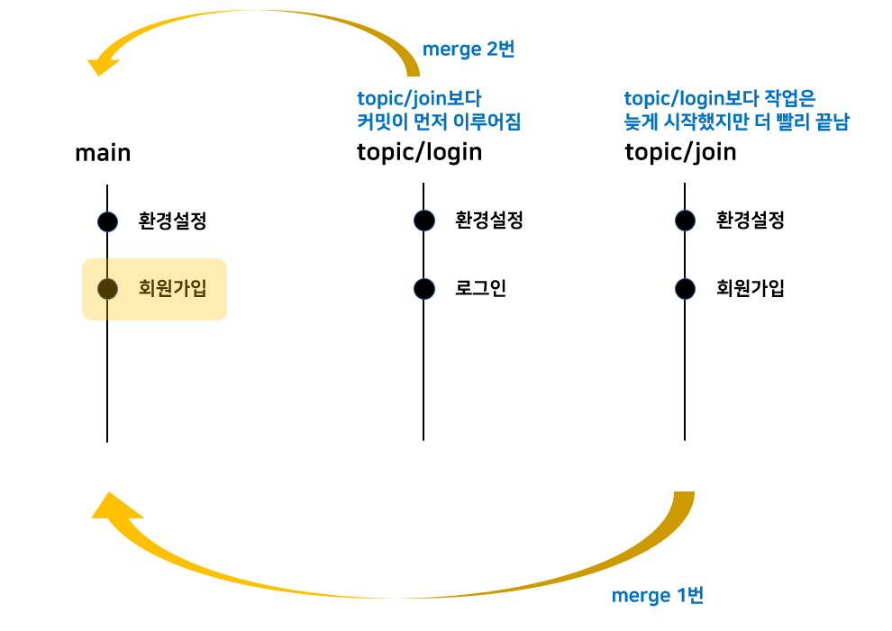

# git-practice
## 브랜치와 merge
개발을 하다 보면 계획과 다른 방향으로 갈 때도 있다. Git을 쓰지 않는다면 원본 코드를 복사해놓은 상태에서 작업을 하겠지만, Git을 이용한다면 브랜치라는 독립된 공간을 생성함으로써 원본 코드에 영향을 끼치지 않고 개발을 이어나갈 수 있다. 브랜치는 여러 개 생성할 수 있으며 브랜치끼리 병합도 가능한데 이를 merge라고 한다. merge는 브랜치들의 공통 조상 이후로 나타나는 형상이 어떠냐에 따라 <i><b>3-way merge</b></i>와 <i><b>fast-forward</b></i>로 나뉜다. 대부분의 경우 Git이 어떤 merge를 취할지 자동으로 정해준다.

- `git merge [브랜치명]` : 특정 브랜치를 현재 checkout된 브랜치에 병합한다.
- `git merge --no-ff [브랜치명]`: merge할 때 fast-forward가 예상되는 경우 사용한다. fast-forward는 원래 merge가 되었다는 커밋 로그가 남지 않는데 이 명령문을 이용하면 로그가 남는다.

같은 파일에 대해 브랜치 별로 내용을 다르게 수정하고 나서 merge를 시도할 경우 수정된 내용의 위치에 따라서 충돌이 일어날 수 있다. 이때는 Git이 자동으로 merge 해주지 못하기 때문에 사용자가 충돌이 일어난 부분을 직접 수정한 뒤 다시 커밋을 남겨야 한다. 

## merge의 순서와 rebase

    

작업 영역에 3개의 브랜치가 있다. main 브랜치에서 ‘환경설정’이란 커밋을 남긴 뒤 topic/login 브랜치를 먼저 만든 다음 topic/join 브랜치를 만들었다. 각각의 브랜치는 이후 main 브랜치에 merge될 예정이다. topic/login 브랜치에서 <i><b>먼저 작업과 커밋</b></i>이 이루어졌지만 topic/join 브랜치의 작업이 더 빨리 끝나 이 브랜치를 main 브랜치에 먼저 merge했다. <i><b>(merge 1번)</b></i> 이윽고 topic/login 브랜치의 작업도 끝나서 이 브랜치도 main 브랜치에 merge하려고 한다. <i><b>(merge 2번)</b></i> 그렇다면 merge의 순서는 어떻게 나타날까?
 
 

    

우리의 예상으론 topic/join을 먼저 merge한 다음에 topic/login을 merge했으니 merge 내역도 회원가입 ➡️ 로그인 순으로 나타날 것 같지만, 실제 내역을 보면 로그인 ➡️ 회원가입 순으로 나타났다. 왜냐하면 merge history 순서를 정할 땐 <i><b>커밋이 먼저 이루어진 브랜치를 우선</b></i>으로 하기 때문이다. 그렇다면 매번 merge를 할 때마다 어떤 브랜치가 제일 먼저 커밋이 이루어졌는지를 고려해야 하는데 상당히 비효율적이다. 우리는 merge하는 대로 커밋 로그가 쌓이길 원한다. 어떻게? rebase를 이용해서.
 
 

    
    

다시 처음 상황으로 돌아가보자. topic/join 브랜치의 작업이 먼저 끝나 main 브랜치로 checkout한 후 merge시켰다. (①) 여기서 topic/login 브랜치도 그냥 merge하면 우리가 원하는 대로 커밋 로그가 쌓이지 않을 것이다. 일단 topic/login 브랜치로 checkout한다. 그런 다음 <code>git rebase main</code>을 한다. (②)  이렇게 하면 main 브랜치의 작업 내역이 topic/login 브랜치로 옮겨지는데 이때 ‘로그인’ 커밋 위의 내역만 수정된다. rebase가 끝나면 다시 main 브랜치로 checkout한 후, topic/login과 merge한다. (③)  그럼 main 브랜치의 커밋 로그가 우리가 원하는 순서대로 쌓이게 된다.
 
 

    

---
## 레퍼런스
<a href="https://youtu.be/V86kq9aAqlI">merge 순서 이해 - 메타코딩</a>

<a href="https://youtu.be/Dn89gD8gcTA">rebase의 개념과 기본 사용법 - 생활코딩</a>
